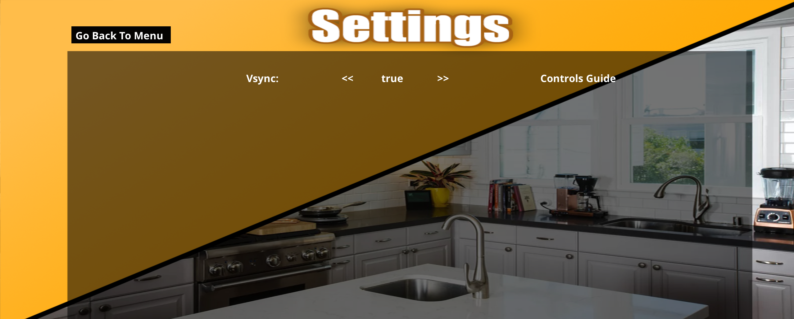

# ChoppedSimulator
Machine learning based simulator that recommends recipes depending on the user's preferences.  
The user must to register the simulation and insert the data for the recommendation:  
  
Based on the data that the user entered (food preferences, allergies, etc), the simulation builds recipes for different types of users (for example: people who have allergies to certain ingredients, diabetes, or personal preferences).  
The user must login with the email and the password that he inserted:  
  
If the user forgot his password, he can reset it by pressing the "Forgot Password?".  
Atfer the user entered his email and password, the simulation will check if the user exsits in the system.  
If the user exists, he will enter to the main menu of the simulation:  
  
Start button - will enter the user to recipe selection so he can start the preparation.  
Profile button - will show to the user all the recipes that he prepared in the simulation.  
Settings - the user can turn off or on the vSync and to see the controls guide of the simulation.
Exit - will exit the simulation.
Continue - if the simulation stopped working because of an error, the user can continue the preparation of the recipe where he stopped.
Start: first, the user need to select the recipe that the simulation recommand based on the user's data:  
  
During the preparation of the recipe, the user can control the portion of each ingredient. In order to receive a full score, the user must select the amount of the ingredients according to the instructions of the recipe that he selected. The user is measured on time according to the type of the recipe he chose to prepare.  
  
After the user done to prepare the recipe, he will receive score:  
  
Profile: will show the history of all the recipes that he selected:  
  
Settings: the settings and the conrtols of the simulation:  
  
